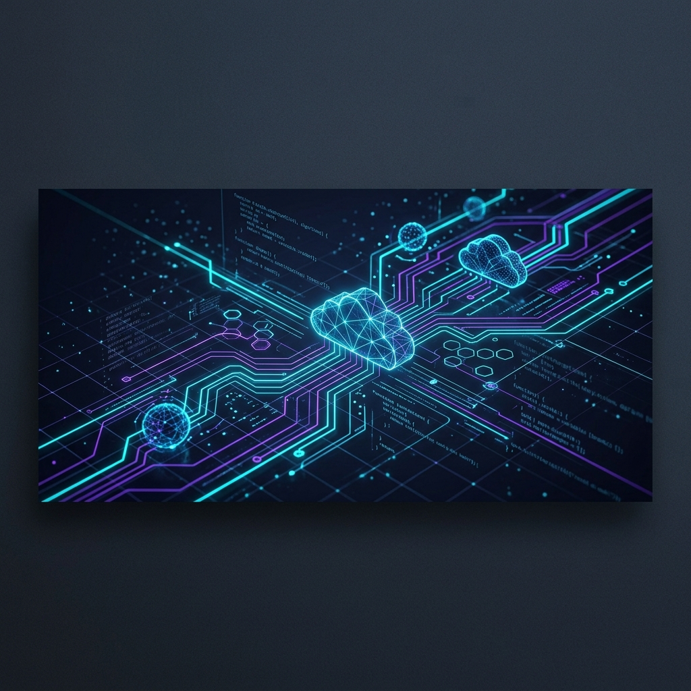

<!-- Header Banner -->

  

# 
👋 Hi, I'm Varun Sharma

  <strong>Associate Product Manager (APM) | Tech-First Product Thinker</strong>

  
  

---

### 🚀 About Me

I am an **Associate Product Manager (APM)** and a **Vellore Institute of Technology (VIT)** Class of 2025 graduate. Starting my journey as a DevOps Engineer Intern, I transitioned into product management to bridge the gap between business strategy, user experience, and technical execution. 

I write clean code, structure comprehensive PRDs, design responsive interfaces, and optimize automated workflows.

- 📍 Based in **Bangalore, India**
- 💡 Passionate about **Product Strategy, PRD Writing, UX/UI Design, & Platform Engineering**
- ⚡ Leveraging a strong technical background in **DevOps, CI/CD, and Full-Stack Development** to build developer-friendly products
- 🧠 Focus areas: FinTech (Global Payroll systems), SaaS workflows, AI-driven automation, and scheduling optimization

---

### 🛠️ My Skillset & Toolkit

  
🎯 Product Management & Strategy

   
  
  
  
  
  
  

  
💻 Full-Stack Development

   
  
  
  
  
  
  
  

  
⚙️ DevOps, Cloud & Automation

   
  
  
  
  
  
  

---

### 📂 Featured Work & Case Studies

#### 🌊 [Pool-n-Pay](https://github.com/VarunSharma110203/pool-n-pay)
> **Product Vision & Full-Stack Development**
- **The Problem**: High cognitive and social friction in sharing group expenses after trips or events.
- **The Solution**: Built a web/mobile platform with a serene beachy visual identity. Introduced **Pool Mode** (upfront contributions) alongside traditional **Split Mode**, featuring pre-filled UPI QR generation for instant payments.
- **Tech**: TypeScript, Vite, Supabase, UPI Integration.

#### 🏫 [CampusGrid](https://github.com/VarunSharma110203/CampusGrid)
> **Product Design & Operations Optimization**
- **The Problem**: Real-time room booking conflicts and operational downtime in university lecture halls.
- **The Solution**: Designed an interactive scheduling and room-swap interface with real-time drag-and-drop clash previews and automated room status notifications.
- **Tech**: JavaScript, HTML5 Canvas/Grid APIs, Interactive DOM.

#### 🤖 [Payroll Compliance Agent](https://github.com/VarunSharma110203/payroll-compliance-agent)
> **Technical Product Management & Automation**
- **The Problem**: Constant changes in global payroll policies cause silent failures and non-compliance in enterprise configurations.
- **The Solution**: Formulated and built a system monitor tracking legislative updates across multiple markets (UK, Japan, Uganda, Zimbabwe) and flagging misalignments in local engine configs.
- **Tech**: Python, GitHub Actions, YAML, structured JSON logs.

#### 📄 Global Payroll Specifications & PRDs
> **Product Management**
- Developed complex compliance structures and calculation requirements for global HR technologies (GBR, JPN, UGA, ZWE modules).
- Wrote detailed PRDs for ScreenAI integrations, platform accessibility features, and custom pay cycles.

---

### 📊 GitHub Insights

  
  

  

---

  <i>"Designing simple experiences, automating complex systems, bridging product and engineering."</i> 
  🔮 <b>Let's collaborate on the next big thing!</b>

